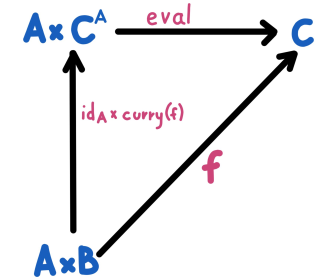

## Exponential Type and Eval
#### Function Types are also called exponential types
#### a -> b  can be expressed as: b^a
```
    f: 1 -> b^a   -- f is an element of b^a
    x: 1 -> a
    y: 1 -> b
    
    (f, x) is equivalent to an element of the product of (b^a x a)
    εab :: b^a x a -> b
    
    eval:: (a => b) x a -> b
```
####  Function application is the elimination rule for function type
- when get an element of function object, the only thing we can do is apply it to an element of the argument type using ε
#### curring is a consequence of exponential types


````
    def f[A, B, C](a: A, b: B) : C = ???
    def eval[A, B](a: A, f: A => B) : B = f(a)
    def curryB[A, B, C](f: (A, B) -> C, b: B): A => C = a => f(a,b)
    
    f(a, b) === eval(a, curryB(f, b))
````
## Categories with terminal objects, binary products, and exponentiation are called Cartesian Closed Category(CCC)

# Fusion
- Fuses the maps by composing the functions:
```
    def calculateInterest: SavingAccount => BigDecimal = ???
    def deductTax: BigDecimal => BigDecimal = ???
    
    trait Account {
    }
    case class SavingAccount()
    case class Balance()
    
    val a1 = SavingAccount("a-001")
    val a2 = SavingAccount("a-002")
    val a3 = SavingAccount("a-003")
    
    val accounts = List(a1, a2, a3)
    accounts.map(calculateInterst).map(deductTax)     ------maps twice
    accounts.map(calculateInterest andThen deductTax) -----composing    
    
```
- Fuses the two map combinators by using function composition, Composition has given you a performance optimization.
- Patterns of **`list.map(f).map(g)`** can be replaced with **`list.map(g compose f)`** for RF functions

# Modules - Functional for small, OO For Large
-  needs to be loosely coupled but strongly cohesive - abstractions need to be small and tight, each of them focused on doing one specific thing
- One module is usually a part of one bounded context, one bounded context can contain many modules.
